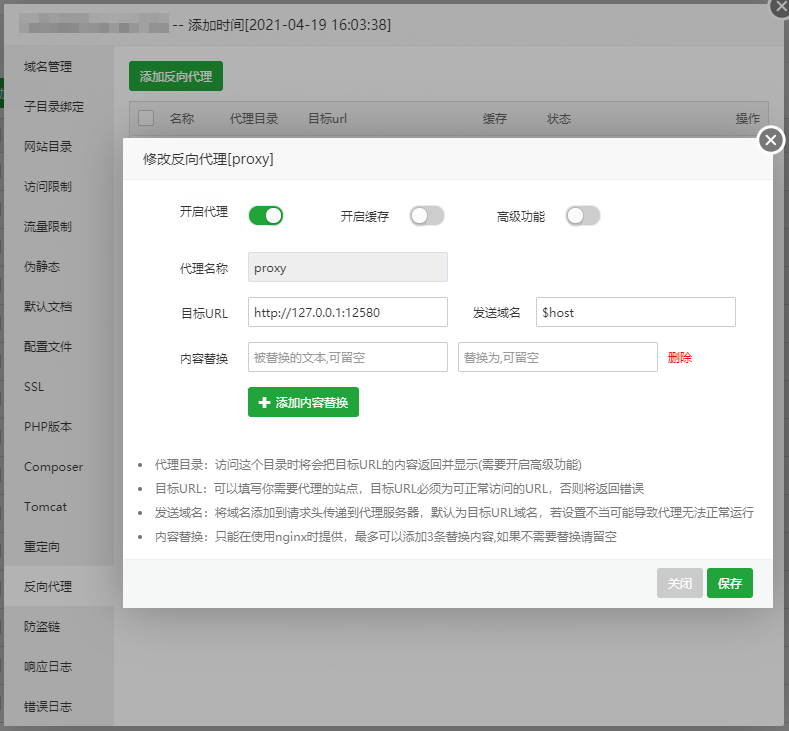

源项目地址：https://github.com/zu1k/proxypool    Fork版: https://github.com/Sansui233/proxypool

可参考 [部署到VPS Step by Step · Sansui233/proxypool Wiki](https://github.com/Sansui233/proxypool/wiki/部署到VPS-Step-by-Step)

## 需要准备

- 一个申请好并添加了DNS解析的的域名(freenom可以申请免费域名并解析)
- 一台具有管理员权限的VPS
- 具有使用ssh登录VPS与基本命令行操作的技能

如果以上超纲了，heroku部署。

此教程nginx之后部分适用于没有申请ssl证书的域名。如果自己已经有证书，需要自行配置nginx的ssl。

## 部署到VPS

登录到VPS后，下载编译好的版本。

```
wget https://github.com/iam7cn/Clash/releases/download/V0.1.5/proxypool-linux-amd64-v0.7.1.tar.gz # 原作者已删除编译版本可自行编译作者有tag
gzip -d proxypool-linux-amd64-v0.7.1.tar.gz # 解压
mv proxypool-linux-amd64-v0.7.1 proxypool #重命名
chmod 755 proxypool # 赋予执行权限
```

再自行下载配置文件(config.yaml与source.yaml)，放在与proxypool相同目录下。

```
wget https://raw.githubusercontent.com/Sansui233/proxypool/v0.7.1/config/config.yaml
wget https://raw.githubusercontent.com/Sansui233/proxypool/v0.7.1/config/source.yaml
```

在config.yaml中的`port`字段设置运行的端口，留空为`12580`。`source`字段更改为`./source.yaml`。**所有字段均可自行按需更改**。

> 注意，如果你的环境变量中有PORT字段，会以环境变量优先。
> 如果端口和已经运行的程序冲突请自行更改端口，或kill占用了端口的进程。

后台运行

```
nohup ./proxypool -c config.yaml 1>>run.log 2>>run.log &
```

检查前端是否正常工作

```
curl http://127.0.0.1:12580
```

## 配置nginx

下载并安装nginx。

```
sudo apt-get install nginx
```

修改nginx的配置中的server部分，设置reverse proxy到proxypool服务的端口。默认配置文件路径可以使用nginx -h查看，通常入口配置文件中会包含了sites-enable文件夹下的配置。具体情况请以自己的机器为准。

```
# vim /etc/nginx/sites-enable/default
server {
	listen 80; # 需要设置为80，稍后certbot验证使用
	server_name proxypoolss.tk; # 你的域名

	location / {
		proxy_pass http://127.0.0.1:12580/; # proxypool服务的地址
	}
}
```

启动nginx

```
nginx
```

查看是否正常工作

```
curl http://127.0.0.1:80
```

以上如果您觉得复杂可以使用宝塔面板

1.宝塔网站里添加一个网站，域名为刚刚解析好并填入配置文件的网址。

2.域名反向代理http://127.0.0.1:12580



3.申请免费SSL

## 配置文件

双击打开配置文件 config.yaml

`domain` : 前端界面显示的域名。网页显示的链接为https（443端口）

`port` : proxypool运行的端口，默认值为12580。如果设置有环境变量$PORT，以环境变量优先。

```
source-files:
  # use local file
  - ./config/source.yaml
  # use web file
  # - https://example.com/config/source.yaml
```

- `source-files`: 订阅源文件列表。

  项目内source文件位于`config/source.yaml`。您可以查看示例链接，以添加更多同类的订阅源。
  可以添加多个source文件，支持同时使用远程的source文件与本地source文件。

`speedtest`: 测速功能开关，默认值为false。由于测速会消耗大量流量。默认关闭此功能。需要请设置为`true`

其他参数可保持默认 详情配置请查看 [配置文件说明 · Sansui233/proxypool Wiki](https://github.com/Sansui233/proxypool/wiki/配置文件说明)

## 增加 / 删除抓取源

双击打开配置文件 source.yaml

根据格式自己进行添加 / 删除

小柒提供 

```
# 模糊抓取订阅链接
- type: webfuzzsub
  options:
    url: https://cdn.jsdelivr.net/gh/iam7cn/Clash@main/Subscription/sub.list
```

## 运行程序

SSH 启动命令

```
nohup ./proxypool -c config.yaml 1>>run.log 2>>run.log &
```

## 更新配置 / 重启程序

```
cd /www/wwwroot/proxypool # cd后面是你自己设置的根目录路径
ps -ef
```

```
UID       PID    PPID C  STIME TTY          TIME CMD
root     32263  21185 52 03:31 pts/0    00:00:11 ./proxypool -c config.yaml
```

然后输入 

```
kill -9 32263 
```

32263 为对应的 PID # 每个人的 PID 是不一样的！

这样就结束进程了

再次启动使用启动命令即可

```
nohup ./proxypool -c config.yaml 1>>run.log 2>>run.log &
```

程序有启动时间，请在 3 分钟后刷新页面查看是否生效。
